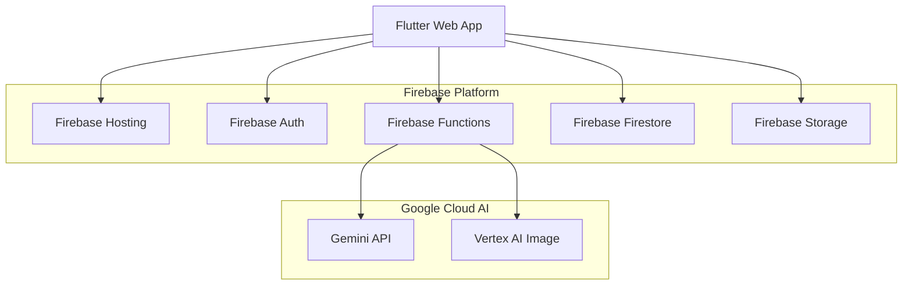

# 🌸 咲想（sakisou） - あなたの想いを、花にして届ける

[](https://flutter.dev)
[](https://firebase.google.com)
[](https://cloud.google.com)
[](https://cloud.google.com/vertex-ai)

## 💡 コンセプト

**咲想（sakisou）**──「咲」は花ひらくこと、「想」は心に抱く想い。  
**想いを咲かせる、花と共に。**

このアプリは、あなたの気持ちを AI が読み取り、それにふさわしい花言葉を持つ花を提案し、花束のイメージを生成してあなたの想いを「かたち」にするサービスです。

言葉にできない想いを、花に託して届けてみませんか？

花束画像は SNS での共有や、実際のギフト購入への導線にもつながり、「気持ちの可視化と贈り物」をサポートします。

## 🎯 ターゲットユーザー

### 主要ユーザー
- **20～40代の女性** : プレゼントやお祝いの機会が多く、花ギフトに興味がある
- **花言葉に興味のある人** : 花の意味にロマンを感じる人
- **表現に悩む人** : 気持ちを言葉にするのが苦手な人

### 利用シーン
- 誕生日、記念日のプレゼント選び
- お見舞い、お悔やみの花選び
- 謝罪や感謝の気持ちを伝えたい時
- SNSで素敵な画像をシェアしたい時

## 🌟 主な機能

### Core Features
- 📝 **感情抽出機能** : 自然文からユーザーの気持ちを分析（Gemini API）
- 🌸 **花言葉マッチング** : 抽出した感情に最適な花言葉を持つ花を推薦
- 🎨 **花束画像生成** : AI による美しい花束のビジュアル作成（Vertex AI）
- 📱 **シェアカード生成** : SNS共有用の美麗なカード画像作成

### Enhanced Features
- 🛍️ **ギフト購入導線** : ECサイト（楽天市場等）への自動リンク
- 💾 **履歴保存機能** : 過去の検索結果と生成画像の保存
- 🔖 **お気に入り機能** : 気に入った花や花束のブックマーク
- 🌐 **多言語対応** : 日本語、英語での利用可能
- 🎨 **ギャラリー機能** : 公開された花束の閲覧・発見

## 🏗️ システム構成



## 🔧 技術スタック

| 機能                 | 使用技術・API                                      |
|----------------------|---------------------------------------------------|
| 感情抽出・花推薦      | Gemini API（自然文解析＋花言葉マッチング）       |
| 花束画像生成          | Vertex AI Image Generation                        |
| フロントエンド        | Flutter Web（レスポンシブUI）                    |
| バックエンド/DB       | Firebase Functions (TypeScript) + Firestore      |
| 認証                 | Firebase Authentication                           |
| ストレージ            | Firebase Storage                                  |
| ホスティング          | Firebase Hosting                                  |
| SNS共有              | Web Share API / カスタムシェアカード              |

## 📋 開発必須条件への対応

### Google Cloud アプリケーション関連サービス
- ✅ **Firebase Functions** : サーバーレスバックエンドAPI
- ✅ **Firebase Hosting** : Webアプリのホスティング
- ✅ **Firestore** : NoSQLデータベース
- ✅ **Firebase Storage** : 画像ファイルストレージ

### Google Cloud AI 技術
- ✅ **Gemini API in Vertex AI** : 感情抽出・花言葉マッチング
- ✅ **Vertex AI Image Generation** : 花束画像の生成

### 特別賞対応
- ✅ **Flutter賞対象** : Flutter でのマルチプラットフォーム開発
- ✅ **Firebase賞対象** : Firebase エコシステムの包括的活用

## 🧪 AI活用の詳細

### Gemini API 活用

**プロンプト例：**
```plaintext
あなたは花言葉に詳しい心理カウンセラーです。
以下の文章に込められた想いをくみ取り、それに合う花言葉を持つ花を3〜5種、理由と共に提案してください。

【メッセージ】
「もう会えないかもしれない。でも、あなたに出会えて良かった。」

【出力形式（必ずJSONで回答）】
{
  "emotions": ["sadness", "gratitude", "farewell"],
  "confidence": 0.85,
  "flowers": [
    {
      "name": "スイートピー",
      "nameEn": "Sweet Pea",
      "meaning": "門出、別れの言葉",
      "reason": "別れの場面にふさわしい花言葉を持つ花です"
    }
  ],
  "explanation": "感情分析の詳細説明"
}
```

### Vertex AI Image Generation

**プロンプト生成例：**
```typescript
function createBouquetPrompt(flowers: Flower[], style: string): string {
  const flowerDescriptions = flowers.map(flower => 
    `${flower.nameEn} (${flower.colors.join(", ")})`
  ).join(", ");
  
  return `A beautiful bouquet containing ${flowerDescriptions}. 
    Style: photorealistic, detailed, natural lighting, professional photography. 
    High quality, elegant arrangement, fresh flowers, 
    conveying heartfelt emotions through traditional Japanese hanakotoba.`;
}
```

## 🎨 UI/UX デザインコンセプト

### デザインテーマ
- **自然・花** をイメージした温かい色調
- **ミニマル** で直感的な操作性
- **感情** を大切にした共感しやすいUI
- **和の美学** を取り入れた上品なデザイン

### カラーパレット
- **Primary** : `#E8B4CB` (桜色)
- **Secondary** : `#F7F3E9` (クリーム色)
- **Accent** : `#6B8E5A` (葉緑色)
- **Text** : `#2C2C2C` (墨色)

### レスポンシブデザイン
- **モバイルファースト** : スマートフォンでの使いやすさを優先
- **タブレット対応** : 中間サイズでの最適化
- **デスクトップ** : 大画面での情報表示の最適化

## 🚀 開発計画

**開発期間**: 2025年6月22日 ～ 2025年6月30日 (9日間)

### Phase 1: 基盤構築（6/22）
- ✅ Firebase プロジェクト設定
- ✅ リポジトリ構造作成
- ✅ Firebase Functions 基本セットアップ
- ✅ Flutter Web 基本セットアップ

### Phase 2: AI コア機能（6/23-6/25）
- 🔄 Gemini API 連携（感情分析）
- 🔄 花言葉データベース構築
- 🔄 Vertex AI 画像生成
- 🔄 API エンドポイント実装

### Phase 3: UI/UX（6/26-6/27）
- ⏳ Flutter Web UI 実装
- ⏳ レスポンシブデザイン
- ⏳ ユーザーフロー完成
- ⏳ 感情入力→花束生成の体験

### Phase 4: 統合・最適化（6/28-6/29）
- ⏳ 機能統合テスト
- ⏳ パフォーマンス最適化
- ⏳ SNSシェア機能
- ⏳ ギャラリー機能

### Phase 5: 完成・デプロイ（6/30）
- ⏳ 本番デプロイ
- ⏳ ドキュメント完成
- ⏳ デモ動画作成
- ⏳ Zenn記事執筆

## 📦 提出物

1. **GitHubリポジトリ** : [wwlapaki310/sakisou](https://github.com/wwlapaki310/sakisou)
2. **デプロイURL** : Firebase Hosting でのWebアプリ
3. **API Documentation** : [docs/API.md](./docs/API.md)
4. **技術解説記事** : Zenn での4000～6000文字記事

## 🏆 狙う賞

- 🥇 **最優秀賞** : 革新的なAIアプリケーション「想いを咲かせる」体験
- 🏅 **Flutter賞** : 美しいUI/UXとレスポンシブデザインの実現
- 🏅 **Firebase賞** : Firebase エコシステムの包括的活用
- 🏅 **Moonshot賞** : 花言葉×AI という新しい発想と文化的価値

## 🛠️ 開発・デプロイ

### クイックスタート

```bash
# リポジトリのクローン
git clone https://github.com/wwlapaki310/sakisou.git
cd sakisou

# 環境設定
cp .env.example .env
# .env ファイルを編集して適切な値を設定

# Firebase Functionsのセットアップ
cd functions
npm install
npm run build

# Flutter Webのセットアップ
cd ../web
flutter pub get
flutter build web

# ローカル開発環境の起動
cd ..
firebase emulators:start
```

### 詳細なセットアップ

- **開発環境** : [docs/SETUP.md](./docs/SETUP.md)
- **API仕様** : [docs/API.md](./docs/API.md)
- **デプロイ手順** : [docs/DEPLOYMENT.md](./docs/DEPLOYMENT.md)
- **開発ガイドライン** : [CONTRIBUTING.md](./CONTRIBUTING.md)

## 🌸 プロジェクトの想い

**咲想（sakisou）**は、デジタル時代における新しい感情表現の可能性を切り拓きます。

AIの力で「伝えたい想い」を美しい花言葉と画像で表現することで、言葉を超えたコミュニケーションを実現します。日本の伝統的な花言葉文化を現代のテクノロジーと融合させ、感情に寄り添うデジタル体験を提供します。

### 技術的革新

- **感情の多次元分析** : 単純な感情分類でなく、複雑で微細な感情を解析
- **文化的AI** : 日本の花言葉文化をAIで現代化し、グローバルに展開
- **リアルタイム生成** : Vertex AI によるインタラクティブな画像生成体験
- **感情ジャーニー** : テキスト → 感情 → 花 → 画像の流れで想いを可視化

### 社会的価値

- **感情表現の支援** : 言葉にできない気持ちを美しく表現
- **文化的継承** : 伝統的な花言葉文化の現代的活用
- **コミュニケーション促進** : 新しい形の感情共有・贈り物体験
- **アクセシビリティ** : 多言語対応により文化の壁を越えた体験

**想いを咲かせる。花と共に、心をつなぐ。**

## 🤝 開発者・コントリビューター

[@wwlapaki310](https://github.com/wwlapaki310)

### コントリビューション

プロジェクトへの貢献を歓迎します！以下をご確認ください：

- [CONTRIBUTING.md](./CONTRIBUTING.md) - 開発ガイドライン
- [Issues](https://github.com/wwlapaki310/sakisou/issues) - バグ報告・機能要望
- [Pull Requests](https://github.com/wwlapaki310/sakisou/pulls) - コード貢献

## 📄 ライセンス

このプロジェクトは MIT License の下で公開されています。詳細は [LICENSE](./LICENSE) ファイルをご確認ください。

## 🙏 謝辞

- **Google AI Hackathon** - 素晴らしい開発機会の提供
- **Firebase・Vertex AI チーム** - 優れた開発プラットフォームの提供
- **Flutter コミュニティ** - 美しいUIフレームワークの開発
- **日本の花言葉文化** - 豊かな感情表現の伝統

---

_想いを込めて、AI Agent Hackathon with Google Cloud にて開発_

**🌸 花と共に、あなたの想いを咲かせましょう 🌸**