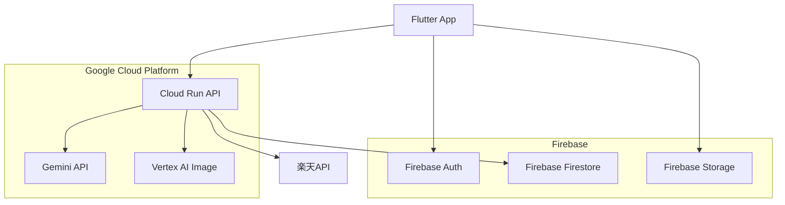

# 🌸 咲想（sakisou） - あなたの想いを、花にして届ける

[](https://flutter.dev)
[](https://firebase.google.com)
[](https://cloud.google.com)

## 💡 コンセプト

**咲想（sakisou）**──「咲」は花ひらくこと、「想」は心に抱く想い。  
**想いを咲かせる、花と共に。**

このアプリは、あなたの気持ちを AI が読み取り、それにふさわしい花言葉を持つ花を提案し、花束のイメージを生成してあなたの想いを「かたち」にするサービスです。

言葉にできない想いを、花に託して届けてみませんか？

花束画像は SNS での共有や、実際のギフト購入への導線にもつながり、「気持ちの可視化と贈り物」をサポートします。

## 🎯 ターゲットユーザー

### 主要ユーザー
- **20～40代の女性** : プレゼントやお祝いの機会が多く、花ギフトに興味がある
- **花言葉に興味のある人** : 花の意味にロマンを感じる人
- **表現に悩む人** : 気持ちを言葉にするのが苦手な人

### 利用シーン
- 誕生日、記念日のプレゼント選び
- お見舞い、お悔やみの花選び
- 謝罪や感謝の気持ちを伝えたい時
- SNSで素敵な画像をシェアしたい時

## 🌟 主な機能

### Core Features
- 📝 **感情抽出機能** : 自然文からユーザーの気持ちを分析（Gemini API）
- 🌸 **花言葉マッチング** : 抽出した感情に最適な花言葉を持つ花を推薦
- 🎨 **花束画像生成** : AI による美しい花束のビジュアル作成（Vertex AI）
- 📱 **シェアカード生成** : SNS共有用の美麗なカード画像作成

### Enhanced Features
- 🛍️ **ギフト購入導線** : ECサイト（楽天市場等）への自動リンク
- 💾 **履歴保存機能** : 過去の検索結果と生成画像の保存
- 🔖 **お気に入り機能** : 気に入った花や花束のブックマーク
- 🌐 **多言語対応** : 日本語、英語での利用可能

## 🏗️ システム構成



## 🔧 技術スタック

| 機能                 | 使用技術・API                                      |
|----------------------|---------------------------------------------------|
| 感情抽出・花推薦      | Gemini API（自然文解析＋花言葉マッチング）       |
| 花束画像生成          | Vertex AI Image Generation                        |
| フロントエンド        | Flutter（マルチデバイス対応UI）                  |
| バックエンド/DB       | Cloud Run (Node.js/Express) + Firebase Firestore |
| SNS共有              | OG画像 / スクリーンショット付きリンク            |
| ギフト導線            | ECサイト固定URL or 楽天API連携                    |

## 📋 開発必須条件への対応

### Google Cloud アプリケーション関連サービス
- ✅ **Cloud Run** : バックエンドAPI のホスティング

### Google Cloud AI 技術
- ✅ **Gemini API in Vertex AI** : 感情抽出・花言葉マッチング
- ✅ **Vertex AI Image Generation** : 花束画像の生成

### 特別賞対応
- ✅ **Flutter賞対象** : Flutter でのマルチプラットフォーム開発
- ✅ **Firebase賞対象** : Firebase Auth, Firestore, Storage の活用

## 🧪 Geminiプロンプト例
```plaintext
あなたは花言葉に詳しい花屋です。
以下の文章に込められた想いをくみ取り、それに合う花言葉を持つ花を3〜5種、理由と共に提案してください。
【メッセージ】
「もう会えないかもしれない。でも、あなたに出会えて良かった。」
【出力形式】
1. 花の名前：◯◯
   花言葉：◯◯
   解説：◯◯◯◯
...
```

## 🎨 UI/UX デザインコンセプト

### デザインテーマ
- **自然・花** をイメージした温かい色調
- **ミニマル** で直感的な操作性
- **感情** を大切にした共感しやすいUI
- **和の美学** を取り入れた上品なデザイン

### カラーパレット
- **Primary** : `#E8B4CB` (桜色)
- **Secondary** : `#F7F3E9` (クリーム色)
- **Accent** : `#6B8E5A` (葉緑色)
- **Text** : `#2C2C2C` (墨色)

## 🚀 開発計画

開発期間: 2025年6月22日 ～ 2025年6月30日 (9日間)

詳細な開発ステップは [Issues](https://github.com/wwlapaki310/sakisou/issues) をご確認ください。

## 📦 提出物

1. **GitHubリポジトリ** : このリポジトリ
2. **デプロイURL** : Cloud Run でのAPI + Firebase Hosting
3. **Zenn記事** : 4000～6000文字での技術解説とデモ

## 🏆 狙う賞

- 🥇 **最優秀賞** : 革新的なAIアプリケーション「想いを咲かせる」体験
- 🏅 **Flutter賞** : 美しいUI/UXの実現
- 🏅 **Firebase賞** : Firebase エコシステムの活用
- 🏅 **Moonshot賞** : 花言葉×AI という新しい発想

## 🌸 プロジェクトの想い

**咲想（sakisou）**は、デジタル時代における新しい感情表現の可能性を切り拓きます。

AIの力で「伝えたい想い」を美しい花言葉と画像で表現することで、言葉を超えたコミュニケーションを実現します。

**想いを咲かせる。花と共に、心をつなぐ。**

## 🤝 開発者

[@wwlapaki310](https://github.com/wwlapaki310)

---

_想いを込めて、AI Agent Hackathon with Google Cloud にて開発_