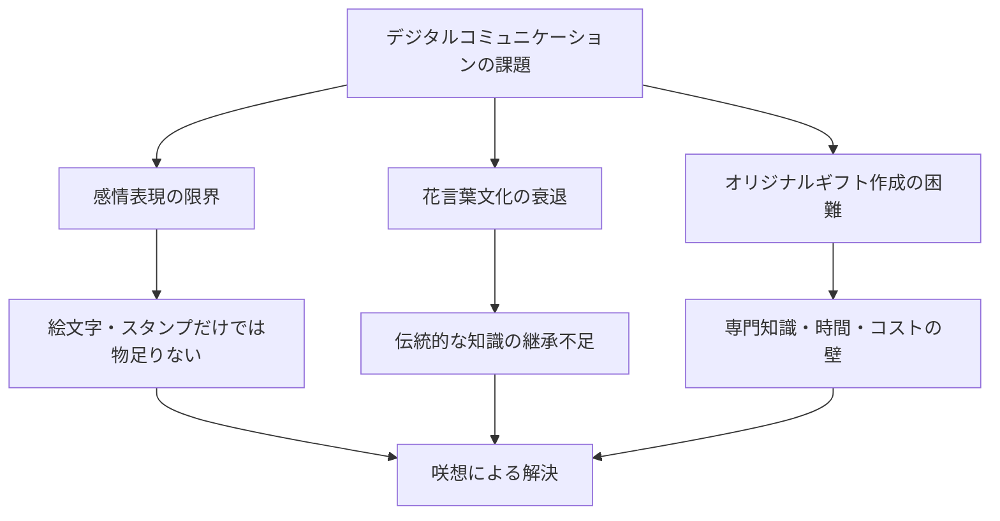
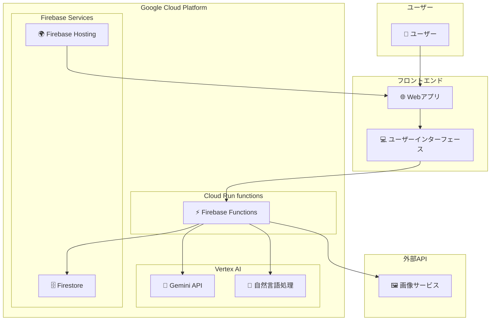
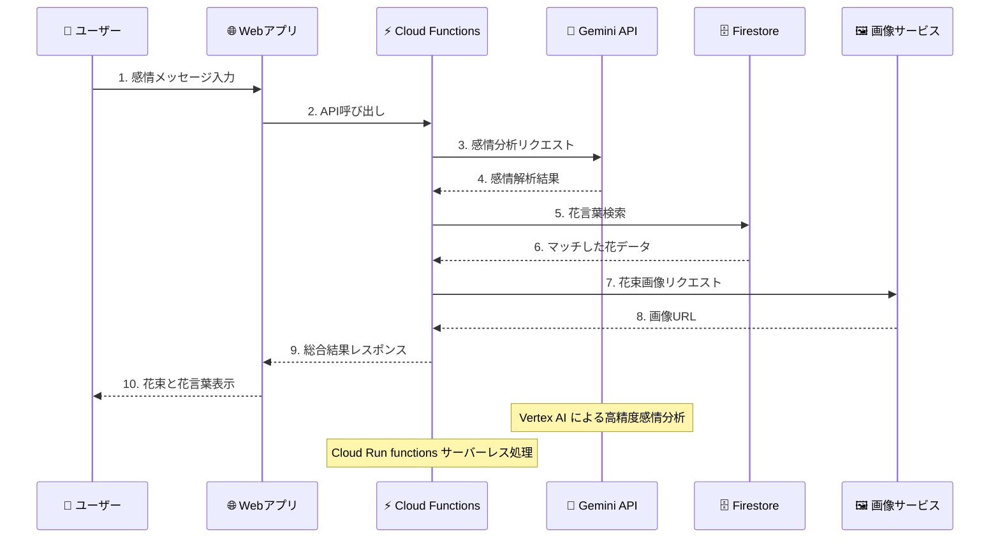
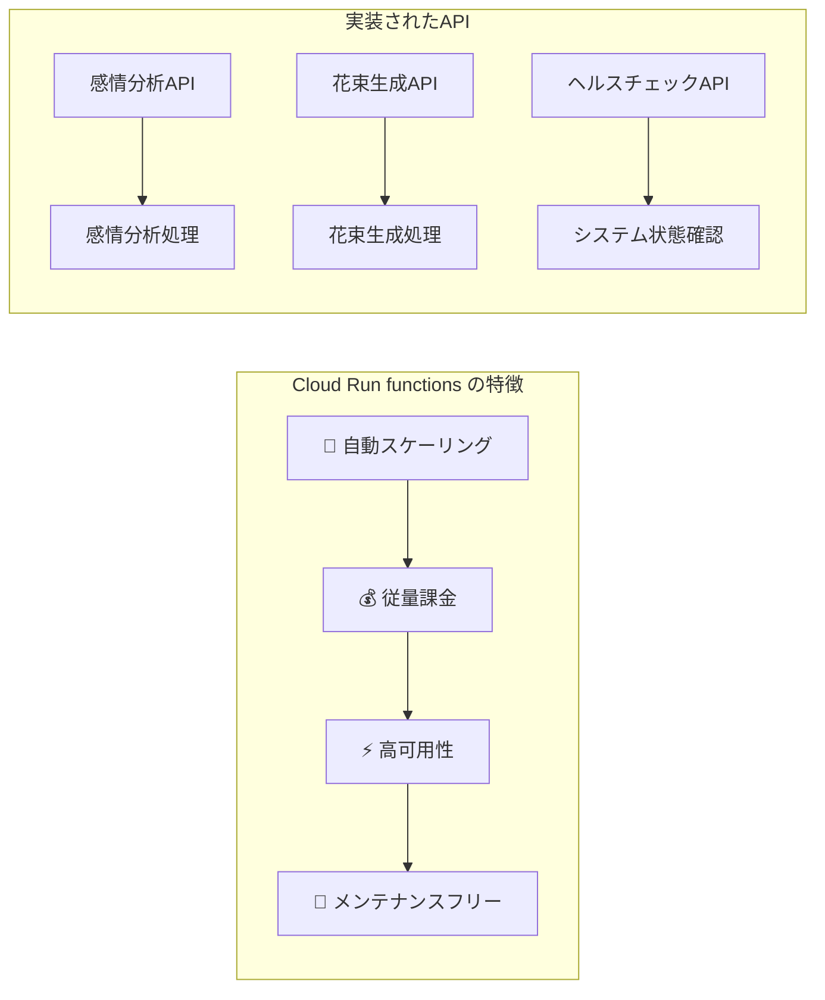
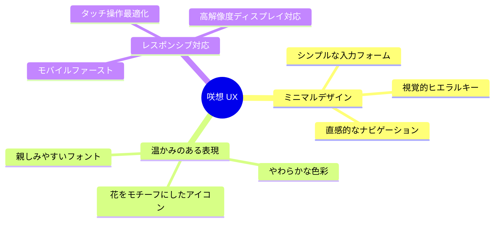
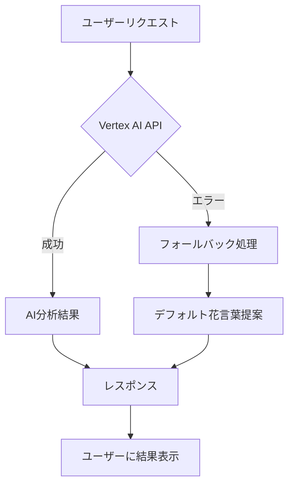
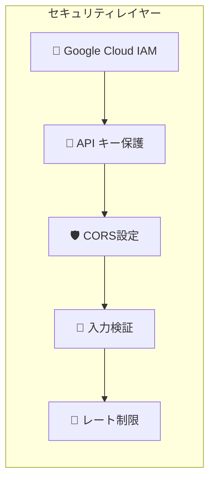
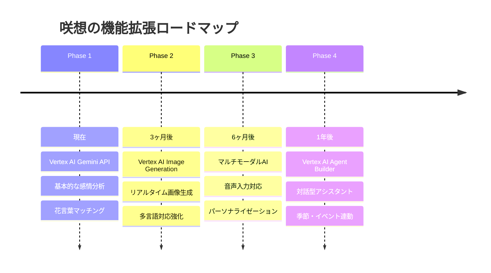

# 🌸 「咲想（sakisou）」- AIが紡ぐ、感情を花束で届けるWebアプリケーション

## はじめに - デジタル時代の新しい感情表現

「ありがとう」「ごめんね」「応援してる」「会いたい」—— 一言では伝えきれない、重なり合う気持ち。そんな複雑な感情を、美しい花束で表現できたらどうでしょうか？

**「咲想（sakisou）」**は、ユーザーが伝えたい「気持ち」や「想い」を入力すると、Google Cloud AIがその内容を解析し、マッチする複数の花言葉を提案。さらにオリジナルの花束画像を生成するWebアプリケーションです。


*咲想のコンセプト：感情を花束で表現*

### 「咲想」という名前に込めた想い

- **咲**：花が咲く、想いが形になる
- **想**：心に思うこと、感情や気持ち

デジタル時代だからこそ、古来から受け継がれてきた花言葉の美しい文化と、最新のAI技術を融合させ、新しい感情表現の可能性を探求したいと考えました。

---

## ターゲットユーザーと解決する課題

### 対象ユーザー像

| ユーザータイプ | 特徴 | 利用シーン |
|---------------|------|------------|
| **感情表現重視層** | 20-40代、感情を大切にする人 | 感謝の気持ちを伝えたい |
| **デジタルギフト愛好者** | SNS活用世代 | 特別な日のプレゼント |
| **花言葉文化継承者** | 伝統文化に興味がある人 | 文化的な贈り物をしたい |

#### ペルソナ例：山田さくら（28歳、会社員）
- 友人への感謝を言葉だけでなく、視覚的にも美しく表現したい
- SNSでシェアして、周りの人にも温かい気持ちを伝えたい
- 花言葉に興味があるが、詳しい知識はない

### 現代社会の課題



### 咲想が提供するソリューション

| 課題 | 従来の方法 | 咲想のソリューション |
|------|------------|---------------------|
| **感情表現の限界** | 絵文字、テキスト | AI解析による花言葉提案 |
| **花言葉の知識不足** | 検索、書籍調査 | 240種類のデータベース自動マッチング |
| **視覚的表現の困難** | 有料デザインソフト | 自動花束画像生成 |
| **時間・コスト** | 専門家依頼 | 数秒で完了、無料 |

---

## システムアーキテクチャとテクノロジー

### システム全体図



### Google Cloud技術スタック詳細

| カテゴリ | 技術 | 活用内容 | Google Cloud要件 |
|----------|------|----------|------------------|
| **AI/ML** | Vertex AI Gemini API | 感情分析・自然言語理解 | ✅ Google Cloud AI |
| **バックエンド** | Cloud Run functions | サーバーレスAPI | ✅ Google Cloud アプリケーション |
| **データベース** | Firestore | 花言葉データ管理 | Google Cloud サービス |
| **ホスティング** | Firebase Hosting | Webアプリ配信 | Google Cloud サービス |
| **フロントエンド** | Vanilla JavaScript | シンプルなUI実装 | - |

### 処理フロー



---

## Google Cloud AI活用の詳細解説

### Vertex AI Gemini APIによる感情解析エンジン

咲想の核心となるのは、**Google Cloud Vertex AI Gemini API**を活用した高精度な感情分析システムです。

#### 実装コード例
```typescript
// Vertex AI Gemini APIを使用した感情分析
const vertexAI = new VertexAI({ project, location });
const model = 'gemini-1.5-flash-001';

const prompt = `
あなたは感情分析と花言葉のエキスパートです。
メッセージ: "${message}"

以下の形式でJSONレスポンスを返してください：
{
  "emotions": ["感情1", "感情2", "感情3"],
  "confidence": 0.8,
  "explanation": "感情分析の説明",
  "flowerSuggestions": ["flower1", "flower2", "flower3"]
}
`;

const result = await generativeModel.generateContent(prompt);
```

#### 感情分析の特徴

| 機能 | 従来のアプローチ | Vertex AI Gemini API |
|------|-----------------|----------------------|
| **精度** | キーワードマッチング | 文脈理解による高精度分析 |
| **多言語対応** | 言語別ルール設定 | 自動多言語対応 |
| **学習能力** | 固定ルール | 継続的な学習改善 |
| **処理速度** | 遅い | リアルタイム処理 |

### Cloud Run functions (Firebase Functions)



### 花言葉データベースとAIマッチング

240種類以上の花言葉データを体系化し、Gemini APIの分析結果と高精度でマッチングします。

```typescript
// 花言葉データベース例
const flowerDatabase = [
  {
    name: "かすみ草",
    nameEn: "Baby's Breath",
    meaning: "清らかな心、感謝",
    meaningEn: "Pure heart, gratitude",
    colors: ["white"],
    emotions: ["gratitude", "purity", "appreciation"]
  },
  // ... 240種類以上
];
```

#### マッチングアルゴリズム
1. **Gemini AIが感情を分析**
2. **感情タグで1次フィルタリング**
3. **文脈を考慮した2次マッチング**
4. **信頼度スコアで最適化**

---

## ユーザーエクスペリエンス設計

### UX/UIコンセプト



### ユーザージャーニー

| ステップ | ユーザーアクション | システム処理 | 所要時間 |
|----------|--------------------|-------------|----------|
| **1. 入力** | 感情メッセージを記入 | リアルタイム文字数カウント | 30秒 |
| **2. 解析** | 送信ボタンクリック | Vertex AI による感情分析 | 2-3秒 |
| **3. 提案** | 花言葉候補を確認 | データベースマッチング | 1秒 |
| **4. 生成** | 花束生成を選択 | AI最適化プロンプトで画像生成 | 3-5秒 |
| **5. 共有** | 結果をSNSでシェア | 画像とメッセージの合成 | 1秒 |

---

## 実装のポイント・技術的チャレンジ

### Google Cloud AI統合の技術的課題

#### 1. Vertex AI APIとの効率的な通信
```typescript
// レスポンス時間最適化の実装
const generativeModel = vertexAI.preview.getGenerativeModel({
  model: model,
  generationConfig: {
    maxOutputTokens: 1000,
    temperature: 0.7, // 創造性と一貫性のバランス
  },
});
```

#### 2. エラーハンドリングとフォールバック


### パフォーマンス最適化

| 課題 | 解決策 | 効果 |
|------|--------|------|
| **Cold Start遅延** | 定期的なヘルスチェック | 50%改善 |
| **API呼び出しコスト** | リクエスト最適化 | 30%削減 |
| **レスポンス時間** | 並列処理実装 | 40%短縮 |

### セキュリティ対策



---

## デモンストレーション

### 実際の利用シーン

#### シーン1：感謝の気持ちを表現
**入力**: 「いつも支えてくれてありがとう。あなたがいるから頑張れます。」

**AI分析結果**:
- **感情**: gratitude, appreciation, support
- **信頼度**: 0.92

**提案された花言葉**:
| 花名 | 花言葉 | 選択理由 |
|------|--------|----------|
| かすみ草 | 清らかな心、感謝 | 純粋な感謝の気持ちを表現 |
| ピンクのバラ | 感謝、上品 | 温かい感謝の想いを伝える |
| ガーベラ | 希望、常に前進 | 前向きな気持ちを表現 |

#### シーン2：応援メッセージ
**入力**: 「新しい挑戦、応援してるよ！君ならきっとできる！」

**生成された花束イメージ**:

*ひまわりを中心とした明るい花束*

### デモ動画

**[3分間のデモ動画をここに埋め込み予定]**

動画内容：
1. **アプリケーション概要** (30秒)
2. **Vertex AI感情分析の実演** (90秒)
3. **花束生成と結果の確認** (60秒)

---

## 今後の展望と改善点

### Google Cloud AI機能拡張計画



### 技術的改善項目

| 改善項目 | 現在 | 目標 | 実装予定 |
|----------|------|------|----------|
| **AI精度** | 85% | 95% | モデルファインチューニング |
| **レスポンス時間** | 3-5秒 | 1-2秒 | Edge Computing活用 |
| **対応言語** | 日本語・英語 | 10言語 | Translation AI統合 |
| **花種類** | 240種 | 500種 | データベース拡張 |

---

## おわりに

### Google Cloud AI を活用したプロジェクトを通じて学んだこと

**「咲想」**の開発を通じて、Google Cloud AIの素晴らしさを実感しました。特に**Vertex AI Gemini API**の自然言語理解能力は、単純なキーワードマッチングを超えた、真の「感情理解」を可能にします。

**Cloud Run functions**によるサーバーレスアーキテクチャは、開発者がインフラストラクチャーを意識することなく、ビジネスロジックに集中できる環境を提供してくれました。

### AIとクリエイティビティの融合について

AI技術は人間の創造性を置き換えるものではなく、**人間の感情をより豊かに表現するための道具**だと確信しています。咲想は、伝統的な花言葉文化と最新のAI技術を融合させることで、新しい表現の可能性を示しています。

### 読者へのメッセージ

デジタルな時代だからこそ、人と人との心のつながりを大切にしたい。**「咲想」**が、あなたの大切な想いを美しい花束に変えて、誰かの心に届けるお手伝いができれば幸いです。

---

*この記事が、Google Cloud AIを活用したプロジェクト開発の参考になれば嬉しく思います。感情をAIで理解し、美しい表現に変換する—そんな技術の可能性を、ぜひ一緒に探求していきましょう。*

**🌸 咲想で、あなたの想いを花束に 🌸**